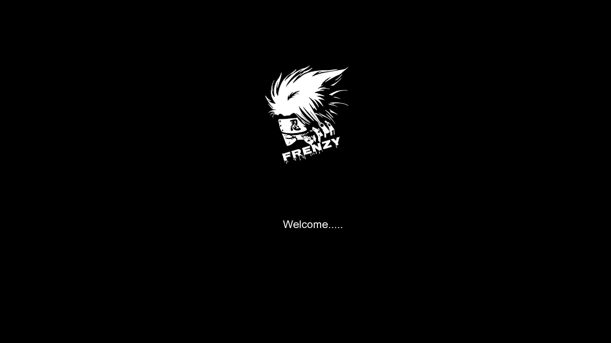

# Frenzy OS 1.1

**A lightweight, high-efficiency desktop OS built from scratch for students**

Frenzy OS is a custom-built desktop operating system designed to deliver maximum performance with minimal system resources. It is best suited for students and developers looking for a fast, minimal, and efficient system. Built entirely from scratch, Frenzy OS focuses on simplicity, speed, and learning.

---

## 🔧 System Requirements

- CPU: 1 Core (x86)
- RAM: 512 MB
- Disk: Minimal space required
- Architecture: x86 (32-bit)

---

## 🚀 Features

- Built from scratch (not based on any existing OS)
- Extremely lightweight and fast
- Rolling release model
- Monolithic kernel
- Open source
- Student-friendly performance tuning

---

## 🖥️ Bootable USB Creation Using Rufus

You can easily create a bootable USB using [Rufus](https://rufus.ie/).

### Steps:
1. **Download** the latest ISO of **Frenzy OS 1.1** from the [releases](#) section.
2. **Insert** a USB drive (at least 1 GB) into your PC.
3. **Open** Rufus.
4. Under **Device**, select your USB drive.
5. Under **Boot selection**, choose **Disk or ISO image**, then click **SELECT** and choose the **Frenzy OS ISO**.
6. Leave the **Partition scheme** as `MBR` and **Target system** as `BIOS or UEFI`.
7. Click **START**.
8. Wait for Rufus to finish creating the bootable USB.

---

## 🛠️ Installation Guide

1. Insert the bootable USB into your PC.
2. Restart your system and enter BIOS/Boot menu (`F12`, `Esc`, or `Del` depending on your system).
3. Select the USB drive as the boot device.
4. Frenzy OS will load into live mode or installer (based on your build).
5. Follow the on-screen steps to install the OS on your preferred partition.

---
## Downloadable Link
1. [Google Drive](https://drive.google.com/file/d/1TRtomH9dwTwfQif01pwq66C7rB-0gyff/view?usp=sharing).
2. [Media Fire](https://www.mediafire.com/file/hdujwp2087kg0tx/Frenzy+1.1.iso/file).
3. [Mega](https://mega.nz/file/Ck4QFawa#RteibJe3Lw-I5A3xPIb5pnnjOurxGKYgLuONeaZeJCQ).
## 🖼️ Screenshots

---

## 👤 Developer

**Developed by Issac Moses**  
Open for collaboration and contributions.

---

## 📜 License

This project is open source and distributed under the [MIT License](https://opensource.org/licenses/MIT).  
You are free to use, modify, and distribute this software under the conditions of the license.

---

## 📬 Feedback

For feedback, bugs, or feature requests, feel free to open an issue or contact the developer.

